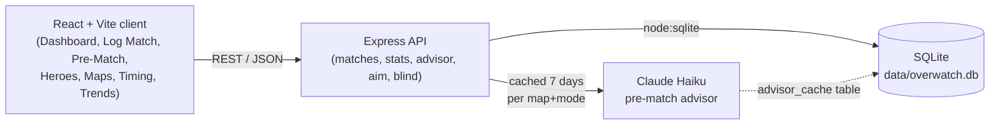

# OW2 Match Tracker

A full-stack match-tracking and analysis app for Overwatch 2 — built to log my own games and figure out what, if anything, in my play actually correlates with winning. It's been in daily use since November 2024 and currently holds **3,489 (...and counting) logged matches spanning 2024-11-28 to 2026-09-09** (overall win rate 48.55%).

## Why this exists

Most "OW2 stats" content is built on small samples dressed up as patterns. This project is the opposite bet: collect real data over two years, apply actual statistical discipline to it, and be willing to throw away conclusions that don't survive a bigger sample.

That happened here, concretely. An earlier pass over a partial dataset (~578 matches) surfaced a set of "key patterns" — specific maps and times of day with strong win rates. As the dataset grew roughly 6x, nearly every one of those patterns regressed to the baseline, which is exactly what you'd expect from noise on n≈18-per-bucket samples. Rather than quietly update the numbers, the app's stats layer now applies multiple-comparison correction before calling anything a finding:

- Across 32 maps tested (n≥30), **none** clear Bonferroni correction. The best-looking outlier (Numbani, 35.2% WR, n=88) is suggestive (p≈0.005) but still fails the corrected threshold at 32 comparisons.
- Across 12 hours-of-day tested (n≥50), exactly **one** clears correction: an unexplained dip at noon (38.5% WR, n=200, p≈0.001). Every other hour, including the ones an earlier pass called "best," sits within noise of the 48.55% baseline.

That's the more interesting result than any individual win-rate number: knowing which of your own patterns are real versus which ones you'd have bet on and been wrong about.

The death-tracking model went through a similar correction. An earlier version asked for a subjective judgment call at every death mid-match (was it a bad trade? poor positioning? bad timing?) — and that data decayed, because judgment calls made under a 10-second respawn clock are slow and unreliable. It was rebuilt around a much narrower, purely factual capture: who killed you, their role, whether it was an ultimate. A separate once-per-match rating (`match_quality`, `result_driver`) captures the one subjective judgment that's cheap enough to survive — a single call per match, not one per event.

## Architecture

React/TypeScript frontend, Express/TypeScript backend, SQLite storage — no ORM, no native SQLite addon (uses Node's built-in `node:sqlite`).



**Data model highlights:**
- `matches` — one row per match: hero, role, map, queue mode, win/loss, and two once-per-match subjective ratings, `match_quality` (`stomp`/`close`) and `result_driver` (`me`/`team`) — both nullable with no default, so an unanswered match stays null rather than silently reading as an answer.
- `match_deaths` — one row per death, fact-only: killer hero, killer role, ultimate yes/no. This replaced an older per-death judgment-call schema (frozen in place as historical `matches.deaths` JSON, no longer written or read) for the reason above.
- `match_heroes` — hero swaps within a match, in order, so mid-match hero changes don't corrupt the primary `matches.hero` record.
- `advisor_cache` — per map + queue-mode cache for the LLM advisor call, TTL 7 days, so repeat visits to the same map don't re-hit the API.

**Backend routes:** `/api/matches`, `/api/stats` (overview, by-hero, by-map, by-hour, by-day, trends, momentum, streaks, hero/map detail, insights), `/api/advisor` (pre-match hero recommendation), `/api/aim` (aim-tracking stats), `/api/blind` and `/api/custom-phases` (sensitivity-testing support).

**Pages:**

| Page | What it does |
|---|---|
| Dashboard | Overview stats, rolling win rate chart, recent matches |
| Pre-Match | Map voting selector, LLM hero recommendation, session health, tilt alert |
| Log Match | Log a match, including per-death fact capture and the two once-per-match ratings |
| Heroes | Per-hero cards — win rate, best/worst maps, best/worst mode, career sparkline |
| Maps | Win rates by map |
| Timing | Win rates by hour and day of week |
| Trends | Rolling win rate chart, momentum, hero/map/mode trajectories |
| Sens Log / Sens Analysis | Mouse-sensitivity testing log and feel-vs-accuracy analysis (a side study built into the same app) |

## Setup

Requires Node 22+ (repo is pinned to v26.4.0 via `.nvmrc`) and Python 3 only if you use the optional spreadsheet migration script.

```bash
git clone https://github.com/26Jinx/overwatch-tracker.git
cd overwatch-tracker
npm install

# Backend needs a .env — copy the example and fill in your own key
cp server/.env.example server/.env
```

`server/.env.example` documents the two variables the backend reads:

| Variable | Purpose |
|---|---|
| `ANTHROPIC_API_KEY` | Required for the Pre-Match LLM advisor. Everything else works without it. |
| `ALLOWED_ORIGINS` | Comma-separated CORS allowlist for the client origin. Defaults to `http://localhost:5173` if unset. |

Then, from the repo root:

```bash
npm run dev
```

This runs both the backend (port 3001) and frontend (port 5173, Vite) concurrently via npm workspaces.

**Day-to-day use: http://localhost:3001.** The Express server on 3001 serves the API *and* a pre-built copy of the client (see "Production build" below) from the same origin — no separate static server, and no Vite dev overhead (unbundled modules, React StrictMode's dev-only double-render). **Port 5173 (the Vite dev server) is for editing only** — use it while working on the code, not for logging matches day to day.

### Production build

`client/current` is a symlink to whichever of `client/dist-a`/`client/dist-b` holds the latest successful build; Express (`server/src/index.ts`) serves straight from it. It's kept current automatically:

```bash
git config core.hooksPath scripts/git-hooks   # one-time, per clone
```

installs a `post-commit` hook that runs `scripts/build-client.sh` in the background after every commit. The script builds into whichever of the two directories *isn't* currently live, then atomically repoints the `client/current` symlink — a request mid-build never sees a half-written build, and a failed build leaves the previous good one running (logged to `scripts/build-client.log`, never fails the commit). Run it by hand any time with:

```bash
./scripts/build-client.sh
```

From another machine on the tailnet: `http://seans-mac-mini:3001`.

### Starting from empty

The database is not included in this repo (see below). On first run, `getDb()` creates `data/overwatch.db` from scratch and applies the full schema — there's nothing to seed or migrate. Log your first match through the Log Match page and the dashboard/stats pages populate from there.

`scripts/migrate.py` exists only to import my own personal match-history spreadsheet (`OW2_by_hero.numbers`, not included) into the database. It's irrelevant unless you have your own spreadsheet in that exact format.

## What's deliberately not in this repo

`data/overwatch.db` — the real database — is excluded. It's not an oversight; it's a personal activity log of when and how I've played, and it doesn't belong in a public repo regardless of how the data is used elsewhere. The schema and every code path that reads/writes it are fully present here; only the data itself is held back.
